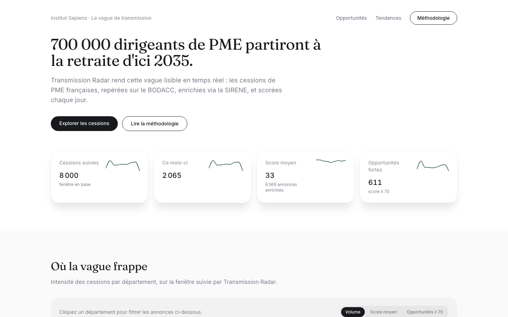

# Transmission Radar

**Every year, tens of thousands of French SMEs change hands — and most of that activity is invisible until it's too late.** Transmission Radar turns the public BODACC legal-announcement feed into a live, filterable map of business transfers (*cessions*) across France, scored for buyer relevance.

It is the companion tool to the Institut Sapiens policy note *"La vague de transmission des PME françaises (2025-2035)"*, which projects a structural wave of SME ownership transfers over the next decade as France's founder generation retires.

**Live demo:** https://transmission-radar.vercel.app

## The problem

Institut Sapiens' research shows France is heading into a decade-long surge of small business transfers, driven by an aging founder population. Buyers, investors, and policymakers currently have no easy way to see this wave as it happens — BODACC publishes thousands of legal announcements a day, buried in unstructured text, with no way to filter by company size, sector, or region, let alone rank them by relevance.

## The solution

Transmission Radar ingests BODACC's "Ventes et cessions" (sales and transfers) announcements daily, enriches each one with SIRENE company data (headcount, sector, age), and computes a 0-100 opportunity score — turning a raw legal feed into a browsable, exportable radar of transmission activity.

- **Dashboard** — 4 KPI cards, monthly volume trend, regional breakdown, and a filterable/searchable table with CSV export.
- **Daily updates** — a Vercel Cron job re-scans recent announcements every day, so the dataset stays current with no manual intervention.
- **Transparent scoring** — every score is explained on the [`/methodologie`](/methodologie) page, and computed once at ingestion time (never guessed at in the UI).

## Screenshots



## Architecture

```
BODACC (Opendatasoft)  ──┐
                          ├──> ingestion pipeline ──> Supabase `cessions` table ──> Next.js dashboard
SIRENE (recherche-        │        (score computed
 entreprises.api.gouv.fr)─┘         at this step)
```

- **Single Supabase table** (`cessions`) — no multi-table normalization. See `supabase/schema.sql`.
- **Backfill script** (`pnpm ingest`) — paginates through BODACC's "Ventes et cessions" family, enriches each announcement by SIREN (throttled to ~5 req/s to respect the SIRENE API's fair use), scores it, and upserts into Supabase (deduplicated on `bodacc_id`).
- **Daily cron route** (`/api/cron/ingest`) — re-runs the same pipeline over a 4-day rolling window, protected by a `CRON_SECRET` check (header or query param). Scheduled via `vercel.json`.
- **Dashboard** (`/`) — server-rendered, reads directly from Supabase with the public anon key (row-level security restricts it to read-only).

## Scoring (0-100)

Computed once per announcement, at ingestion/enrichment time:

| Criterion | Max points | Logic |
|---|---|---|
| Headcount | 35 | Peaks at 20-49 employees (core SME transmission range) |
| Company age | 25 | 25 pts if >15 years old, tapering down below that |
| Sector | 25 | Industry 25 / Construction (BTP) 20 / Wholesale trade 15 / other 5 |
| Region | 15 | 15 pts outside Île-de-France, 5 pts within — the transmission wave described in the Sapiens note is most acute in the regions |

Full rationale in [`/methodologie`](/methodologie). Announcements whose SIREN enrichment fails have no score and show as "N/A".

## Stack

- [Next.js](https://nextjs.org) (App Router, TypeScript strict)
- [Tailwind CSS](https://tailwindcss.com)
- [Supabase](https://supabase.com) (Postgres)
- [Recharts](https://recharts.org)
- [Vercel](https://vercel.com) (hosting + cron)
- pnpm, conventional commits

## Getting started

```bash
pnpm install
cp .env.local.example .env.local   # fill in your Supabase project keys
```

Create the schema (SQL editor or any Postgres client):

```bash
psql "$DATABASE_URL" -f supabase/schema.sql
```

Backfill historical data:

```bash
pnpm ingest -- --days=90     # or any window you want
```

Run the dashboard:

```bash
pnpm dev
```

Other commands: `pnpm build`, `pnpm lint`.

## Data sources

Public APIs only, no scraping:

1. **BODACC** via Opendatasoft (`bodacc-datadila.opendatasoft.com`), dataset `annonces-commerciales`.
2. **SIRENE** via `recherche-entreprises.api.gouv.fr`, queried by SIREN.
